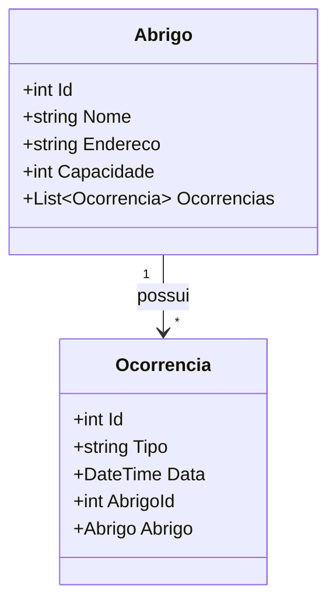

# ColdConnectNET

## 🧑🧑 Integrantes

Henzo Boschiero Puchetti - Rm555179
Luann Domingos Mariano - Rm558548

## 📖 Visão Geral

ColdConnectNET é uma aplicação web robusta desenvolvida em ASP.NET Core com Entity Framework Core para facilitar o gerenciamento de abrigos e ocorrências relacionadas. O sistema oferece uma API RESTful completa que permite operações CRUD (Criar, Ler, Atualizar e Deletar) sobre os dados de abrigos e suas ocorrências associadas, com uma interface visual MVC para administração simples e intuitiva.

Este projeto visa auxiliar organizações e equipes que lidam com abrigos e precisam manter um registro detalhado e atualizado das ocorrências para suporte, controle e análises futuras, garantindo transparência e integridade dos dados.

---

## 🎯 Objetivo da Solução

- **Gerenciamento eficiente de abrigos**: Cadastro, atualização, listagem e remoção de abrigos.
- **Controle de ocorrências**: Registro e acompanhamento das ocorrências associadas a cada abrigo.
- **Integração com Oracle DB**: Uso do banco Oracle via Entity Framework Core para persistência robusta.
- **Documentação interativa da API**: Swagger para testes rápidos e documentação clara.
- **Interface amigável MVC**: Páginas para visualização e manipulação dos dados via navegador, simplificando o uso para usuários não técnicos.

---

## 📂 Estrutura do Projeto

- **ColdConnectNET.API**: Backend com controllers, models e acesso ao banco.
- **Views MVC**: Páginas Razor para visualização e gerenciamento via interface web.
- **Configuração Oracle e EF Core**: Integração com Oracle usando DbContext ColdContext.
- **Swagger**: Documentação e testes de API via `/swagger`.

---

## 🚀 Tecnologias Utilizadas

- ASP.NET Core 8.0
- Entity Framework Core com Oracle
- Oracle Database 19c/21c (ou versão compatível)
- Swagger UI (Swashbuckle.AspNetCore)
- Razor Views MVC
- C# 12

---

## 📐 Diagrama de Entidades


## 📈 Diagrama de Arquitetura

```
    graph TD
    Client -->|HTTP| API[ASP.NET Core API]
    API --> Db[Oracle Database]
    API --> Views[MVC Views]

```
## 🔠 Fluxograma
```
    flowchart TD
    A[Início] --> B{Deseja cadastrar um novo Abrigo?}
    B -- Sim --> C[Preencher dados do Abrigo]
    C --> D[Salvar Abrigo no Banco]
    B -- Não --> E{Deseja cadastrar uma Ocorrência?}
    E -- Sim --> F[Selecionar Abrigo Existente]
    F --> G[Preencher dados da Ocorrência]
    G --> H[Salvar Ocorrência no Banco]
    E -- Não --> I[Fim]

```

## ⚙️ Como Rodar o Projeto

### 1. Clonar o Repositório

```bash
git clone https://github.com/henzopuchetti/ColdConnectNET.git
cd ColdConnectNET
```

### 2. Configurar a Connection String

No arquivo `appsettings.json`, configure sua string de conexão Oracle:

```json
{
  "ConnectionStrings": {
    "OracleConnection": "User Id=usuario;Password=senha;Data Source=seu_oracle_db"
  }
}
```

### 3. Restaurar Pacotes e Aplicar Migrações

```bash
dotnet restore
dotnet ef database update
```

### 4. Executar a Aplicação

```bash
dotnet run
```

---

```

## 🧭 Testando a API via Swagger

Após rodar o projeto, abra no navegador:

```
https://localhost:5000/swagger
```

Você verá a interface do Swagger UI listando todos os endpoints disponíveis.

### Como usar o Swagger para Abrigo e Ocorrência:

1. **Expandir o endpoint desejado**, por exemplo: `GET /api/abrigo`.
2. **Clique em "Try it out"** para ativar o modo de edição.
3. Para requisições que precisam de parâmetros (como PUT e DELETE), insira o ID ou dados no corpo conforme solicitado.
4. Clique em **Execute**.
5. Observe a resposta da API no painel abaixo (status HTTP, cabeçalhos e corpo da resposta).

---

## 🔧 Exemplos de Requisições HTTP

### Abrigo

#### GET Todos os Abrigos

```
GET /api/abrigo
```

Resposta:

```json
[
  {
    "id": 1,
    "nome": "Abrigo Central",
    "endereco": "Rua Principal, 123",
    "ocorrencias": [ ... ]
  }
]
```

#### POST Criar Abrigo

```json
POST /api/abrigo
Content-Type: application/json

{
  "nome": "Abrigo Novo",
  "endereco": "Av. das Flores, 456"
}
```

#### DELETE Abrigo (ID = 1)

```
DELETE /api/abrigo/1
```

---

### Ocorrência

#### GET Todas as Ocorrências

```
GET /api/ocorrencia
```

#### POST Criar Ocorrência

```json
POST /api/ocorrencia
Content-Type: application/json

{
  "tipo": "frio extremo",
  "data": "2025-06-02T14:00:00",
  "abrigoId": 1
}
```

#### DELETE Ocorrência (ID = 1)

```
DELETE /api/ocorrencia/1
```

---

## 🖥️ Visualização via Interface MVC

Além da API, o projeto inclui uma interface web com páginas MVC que permitem:

- Visualizar a lista de abrigos (`/Abrigo`).
- Navegar para detalhes de cada abrigo.
- Visualizar ocorrências associadas a abrigos.
- Operações básicas de CRUD via interface gráfica.

### Como acessar:

1. Execute o projeto.
2. Navegue até:

```
Abrigo:
http://localhost:5000/Abrigo

Ocorrencia:
http://localhost:5000/ocorrencias
```

3. Use a interface para navegar entre abrigos e ocorrências.
4. Para testar alterações, utilize a API via Swagger e atualize a página MVC para ver os dados atualizados.

---

## 🧪 Testes Automatizados

No momento, o projeto possui testes unitários básicos (se não tiver, pode ser implementado).

Para executar os testes:

```bash
dotnet test
```

Recomenda-se desenvolver testes para validar regras de negócio, endpoints e integração com o banco.

---

